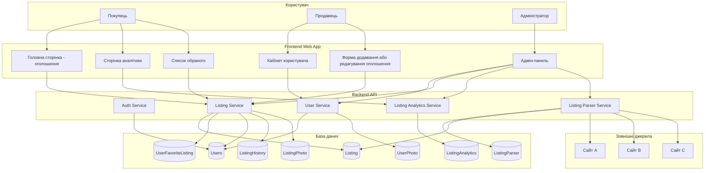

```mermaid
flowchart TD
    subgraph UserSide[Користувач]
        U1[Покупець] 
        U2[Продавець]
        U3[Адміністратор]
    end

    subgraph Frontend[Frontend Web App]
        F1[Головна сторінка - оголошення]
        F2[Кабінет користувача]
        F3[Форма додавання або редагування оголошення]
        F4[Сторінка аналітики]
        F5[Список обраного]
        F6[Адмін-панель]
    end

    subgraph Backend[Backend API]
        B1[Auth Service]
        B2[Listing Service]
        B3[User Service]
        B4[Listing Analytics Service]
        B5[Listing Parser Service]
    end

    subgraph External[Зовнішні джерела]
        E1[Сайт A]
        E2[Сайт B]
        E3[Сайт C]
    end

    subgraph Database[База даних]
        D1[(Users)]
        D2[(UserFavoriteListing)]
        D3[(Listing)]
        D4[(ListingParser)]
        D5[(ListingAnalytics)]
        D6[(ListingHistory)]
        D7[(ListingPhoto)]
        D8[(UserPhoto)]
    end

    %% Взаємодія користувачів
    U1 --> F1
    U1 --> F4
    U1 --> F5
    U2 --> F2
    U2 --> F3
    U3 --> F6

    %% Frontend <-> Backend
    F1 --> B2
    F2 --> B3
    F3 --> B2
    F4 --> B4
    F5 --> B2
    F6 --> B3
    F6 --> B2
    F6 --> B4
    F6 --> B5

    %% Backend <-> Database
    B1 --> D1
    B2 --> D3
    B2 --> D2
    B2 --> D1
    B2 --> D6
    B2 --> D7
    B3 --> D1
    B3 --> D8
    B4 --> D5
    B5 --> D4
    B5 --> D3

    %% Parser -> External
    B5 --> E1
    B5 --> E2
    B5 --> E3

```
