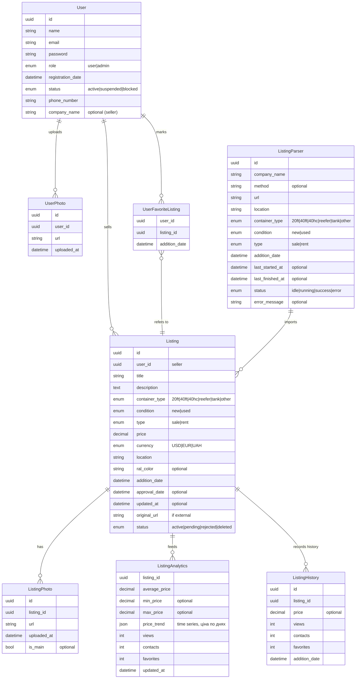

# ER діаграма

```mermaid
erDiagram
    User {
      uuid id
      string name
      string email
      string password
      enum role "user|admin"
      datetime registration_date
      enum status "active|suspended|blocked"
      string phone_number
      string company_name "optional (seller)"
    }

    UserPhoto {
      uuid id
      uuid user_id
      string url
      datetime uploaded_at
    }

    Listing {
      uuid id
      uuid user_id "seller"
      string title
      text description
      enum container_type "20ft|40ft|40hc|reefer|tank|other"
      enum condition "new|used"
      enum type "sale|rent"
      decimal price
      enum currency "USD|EUR|UAH"
      string location
      string ral_color "optional"
      datetime addition_date
      datetime approval_date "optional"
      datetime updated_at "optional"
      string original_url "if external"
      enum status "active|pending|rejected|deleted"
    }

    ListingPhoto {
      uuid id
      uuid listing_id
      string url
      datetime uploaded_at
      bool is_main "optional"
    }

    UserFavoriteListing {
      uuid user_id
      uuid listing_id
      datetime addition_date
    }

    ListingParser {
      uuid id
      string company_name
      string method "optional"
      string url
      string location
      enum container_type "20ft|40ft|40hc|reefer|tank|other"
      enum condition "new|used"
      enum type "sale|rent"
      datetime addition_date
      datetime last_started_at "optional"
      datetime last_finished_at "optional"
      enum status "idle|running|success|error"
      string error_message "optional"
    }

    ListingAnalytics {
      uuid listing_id
      decimal average_price
      decimal min_price "optional"
      decimal max_price "optional"
      json price_trend "time series, ціна по днях"
      int views
      int contacts
      int favorites
      datetime updated_at
    }

    ListingHistory {
      uuid id
      uuid listing_id
      decimal price "optional"
      int views
      int contacts
      int favorites
      datetime addition_date
    }

    %% Relations
    User ||--o{ Listing : "sells"
    User ||--o{ UserPhoto : "uploads"
    User ||--o{ UserFavoriteListing : "marks"
    UserFavoriteListing }o--|| Listing : "refers to"

    Listing ||--o{ ListingPhoto : "has"
    Listing ||--o{ ListingAnalytics : "feeds"
    Listing ||--o{ ListingHistory : "records history"
    ListingParser ||--o{ Listing : "imports"

```
