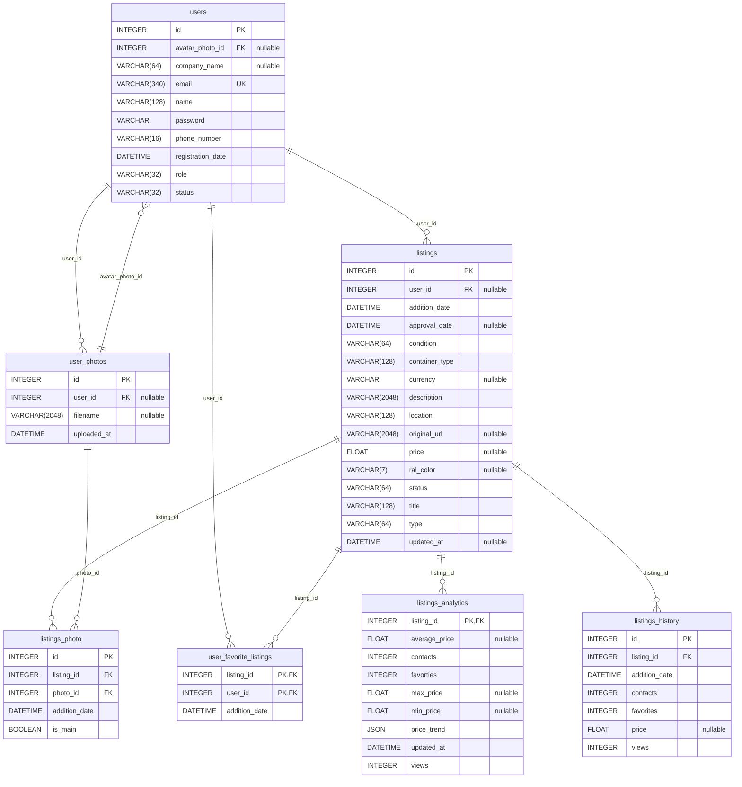

```mermaid
erDiagram
  users {
    INTEGER id PK
    INTEGER avatar_photo_id FK "nullable"
    VARCHAR(64) company_name "nullable"
    VARCHAR(340) email UK
    VARCHAR(128) name
    VARCHAR password
    VARCHAR(16) phone_number
    DATETIME registration_date
    VARCHAR(32) role
    VARCHAR(32) status
  }

  listings {
    INTEGER id PK
    INTEGER user_id FK "nullable"
    DATETIME addition_date
    DATETIME approval_date "nullable"
    VARCHAR(64) condition
    VARCHAR(128) container_type
    VARCHAR currency "nullable"
    VARCHAR(2048) description
    VARCHAR(128) location
    VARCHAR(2048) original_url "nullable"
    FLOAT price "nullable"
    VARCHAR(7) ral_color "nullable"
    VARCHAR(64) status
    VARCHAR(128) title
    VARCHAR(64) type
    DATETIME updated_at "nullable"
  }

  listings_photo {
    INTEGER id PK
    INTEGER listing_id FK
    INTEGER photo_id FK
    DATETIME addition_date
    BOOLEAN is_main
  }

  user_favorite_listings {
    INTEGER listing_id PK,FK
    INTEGER user_id PK,FK
    DATETIME addition_date
  }

  user_photos {
    INTEGER id PK
    INTEGER user_id FK "nullable"
    VARCHAR(2048) filename "nullable"
    DATETIME uploaded_at
  }

  listings_analytics {
    INTEGER listing_id PK,FK
    FLOAT average_price "nullable"
    INTEGER contacts
    INTEGER favorties
    FLOAT max_price "nullable"
    FLOAT min_price "nullable"
    JSON price_trend
    DATETIME updated_at
    INTEGER views
  }

  listings_history {
    INTEGER id PK
    INTEGER listing_id FK
    DATETIME addition_date
    INTEGER contacts
    INTEGER favorites
    FLOAT price "nullable"
    INTEGER views
  }

  user_photos ||--o{ users : avatar_photo_id
  users ||--o{ listings : user_id
  listings ||--o{ listings_photo : listing_id
  user_photos ||--o{ listings_photo : photo_id
  users ||--o{ user_favorite_listings : user_id
  listings ||--o{ user_favorite_listings : listing_id
  users ||--o{ user_photos : user_id
  listings ||--o{ listings_analytics : listing_id
  listings ||--o{ listings_history : listing_id
```
