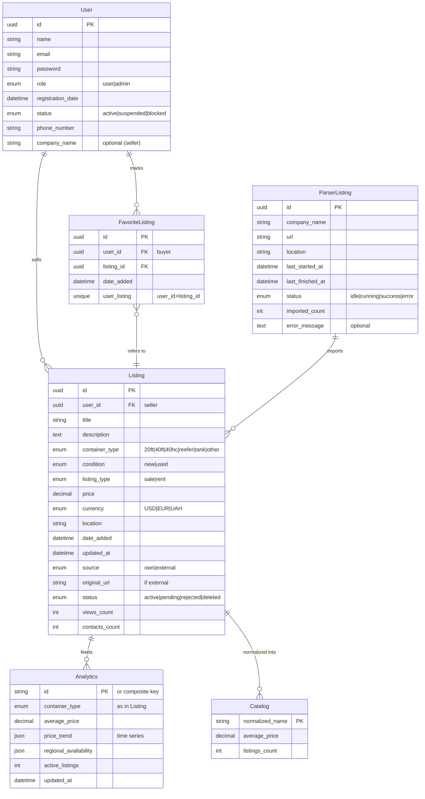

# To be adjusted...

```mermaid
erDiagram
    User {
      uuid id PK
      string name
      string email
      string password
      enum role "user|admin"
      datetime registration_date
      enum status "active|suspended|blocked"
      string phone_number
      string company_name "optional (seller)"
    }

    Listing {
      uuid id PK
      uuid user_id FK "seller"
      string title
      text description
      enum container_type "20ft|40ft|40hc|reefer|tank|other"
      enum condition "new|used"
      enum listing_type "sale|rent"
      decimal price
      enum currency "USD|EUR|UAH"
      string location
      datetime date_added
      datetime updated_at
      enum source "own|external"
      string original_url "if external"
      enum status "active|pending|rejected|deleted"
      int views_count
      int contacts_count
    }

    FavoriteListing {
      uuid id PK
      uuid user_id FK "buyer"
      uuid listing_id FK
      datetime date_added
      unique user_listing "user_id+listing_id"
    }

    ParserListing {
      uuid id PK
      string company_name
      string url
      string location
      datetime last_started_at
      datetime last_finished_at
      enum status "idle|running|success|error"
      int imported_count
      text error_message "optional"
    }

    Analytics {
      string id PK "or composite key"
      enum container_type "as in Listing"
      decimal average_price
      json price_trend "time series"
      json regional_availability
      int active_listings
      datetime updated_at
    }

    Catalog {
      string normalized_name PK
      decimal average_price
      int listings_count
    }

    %% Relations
    User ||--o{ Listing : "sells"
    User ||--o{ FavoriteListing : "marks"
    FavoriteListing }o--|| Listing : "refers to"
    ParserListing ||--o{ Listing : "imports"
    Listing ||--o{ Analytics : "feeds"
    Listing ||--o{ Catalog : "normalized into"
```
